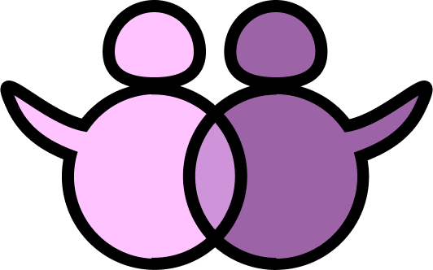

[![Contributors][contributors-shield]][contributors-url]
[![Forks][forks-shield]][forks-url]
[![Stargazers][stars-shield]][stars-url]
[![Issues][issues-shield]][issues-url]
[![LinkedIn][linkedin-shield]][linkedin-url]

<!-- PROJECT LOGO -->
 

  

  <h3 align="center">Diaspora</h3>

  

    Diaspora is a social media app inspired by Tinder.
     
    <a href="https://github.com/mapokapo/diaspora-app/blob/master/screenshots/README.md">View Screenshots</a>
    ·
    <a href="https://github.com/mapokapo/diaspora-app/issues">Report Bug</a>
    ·
    <a href="https://github.com/mapokapo/diaspora-app/issues">Request Feature</a>
  

<!-- TABLE OF CONTENTS -->

  
<h2 style="display: inline-block">Table of Contents</h2>

  <ol>
    <li>
      <a href="#about-the-project">About The Project</a>
      <ul>
        <li><a href="#built-with">Built With</a></li>
      </ul>
    </li>
    <li><a href="#contributing">Contributing</a></li>
    <li><a href="#contact">Contact</a></li>
  </ol>

<!-- ABOUT THE PROJECT -->

## About The Project

Diaspora is a casual social media app made to meet new people and friends. It is heavily inpsired by Tinder with its characteristic "swipe-match" system.
The app is a great way for introverted or antisocial people to get friends, be it online or in person.
It is made to be friendly and accessible to as many people as possible, and to ensure a comfortable experience.

### Built With

- [Flutter](https://flutter.dev/)

<!-- CONTRIBUTING -->

## Contributing

Contributions are what make the open source community such an amazing place to be learn, inspire, and create. Any contributions you make are **greatly appreciated**.

1. Fork the Project
2. Create your Feature Branch (`git checkout -b feature/AmazingFeature`)
3. Commit your Changes (`git commit -m 'Add some AmazingFeature'`)
4. Push to the Branch (`git push origin feature/AmazingFeature`)
5. Open a Pull Request

<!-- CONTACT -->

## Contact

Leo Petrovic - leopetrovic11@gmail.com

Project Link: [https://github.com/mapokapo/diaspora-app](https://github.com/mapokapo/diaspora-app)

<!-- MARKDOWN LINKS & IMAGES -->
<!-- https://www.markdownguide.org/basic-syntax/#reference-style-links -->

[contributors-shield]: https://img.shields.io/github/contributors/mapokapo/diaspora-app.svg?style=for-the-badge
[contributors-url]: https://github.com/mapokapo/diaspora-app/graphs/contributors
[forks-shield]: https://img.shields.io/github/forks/mapokapo/diaspora-app.svg?style=for-the-badge
[forks-url]: https://github.com/mapokapo/diaspora-app/network/members
[stars-shield]: https://img.shields.io/github/stars/mapokapo/diaspora-app.svg?style=for-the-badge
[stars-url]: https://github.com/mapokapo/diaspora-app/stargazers
[issues-shield]: https://img.shields.io/github/issues/mapokapo/diaspora-app.svg?style=for-the-badge
[issues-url]: https://github.com/mapokapo/diaspora-app/issues
[linkedin-shield]: https://img.shields.io/badge/-LinkedIn-black.svg?style=for-the-badge&logo=linkedin&colorB=555
[linkedin-url]: https://linkedin.com/in/leo-petrović-7047b1162
